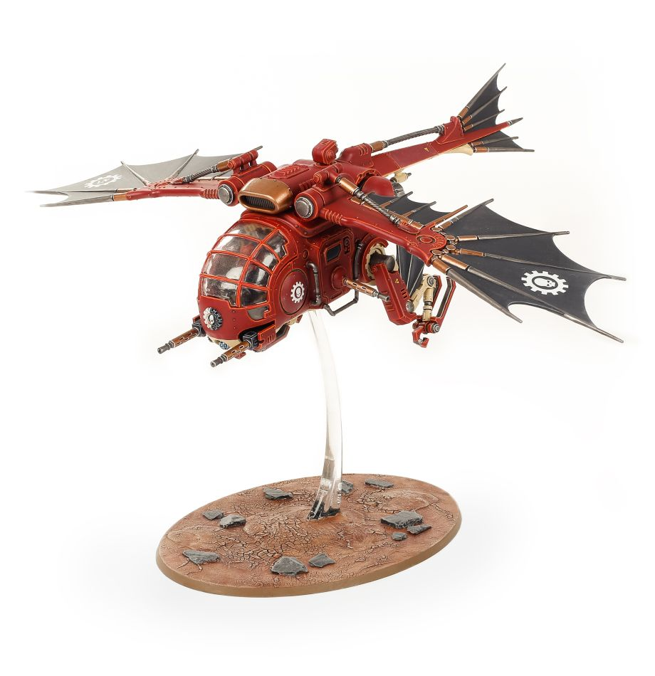

# 始祖鳥燧火轟炸機（Archaeopter Fusilave）
## 官方產品圖片

> **圖片來源：** [Games Workshop 官方商店](https://www.warhammer.com/en-WW/shop/Adeptus-Mechanicus-Archaeopter-Fusilave-2020)。官方商品主圖。
> **圖片擷取日期：** 2026-08-22。

本頁依使用者提供的《機械修會11版中文1.0.pdf》建立，並以官方 Munitorum Field Manual v1.2 的現行點數為準。規則關鍵字採繁體中文；英文名稱僅保留作為原文索引。

## 單位數據

| M | T | SV | W | LD | OC | 特殊保護 |
|---:|---:|---:|---:|---:|---:|---:|
| — | 9 | 3+ | 10 | 7+ | — | — |

## 能力

**陣營：機神律令。** 本模型可受機神律令影響。

**核心：致命破滅 D3。** 本模型擁有致命破滅 D3。

**炸彈投放。** 在對手近戰階段結束時，選擇本模型視線中 24 吋內且不具獨行特工的敵方單位；擲 6D6，每個 4+ 造成 1 點致命傷害。

**指揮鏈路。** 本模型成為你的策略目標時，擲 D6；5+ 時你獲得 1 CP。

**嚴重損傷。** 本模型傷口為 1–3 時，攻擊命中結果減 1。

## 武器

| 武器 | 射程 | A | BS／WS | S | AP | D | 能力 |
|---|---:|---:|---:|---:|---:|---:|---|
| 智能重機槍陣列 | 36 | 9 | 4+ | 4 | 0 | 1 | 速射 9、連擊 1、雙聯 |
| 裝甲機體 | 近戰 | 3 | 4+ | 6 | 0 | 1 | 無 |

## 編制、點數與裝備

| 項目 | 內容 |
|---|---|
| 編制 | 1 架始祖鳥燧火轟炸機。 |
| 點數 | 160 分 |
| 裝備 | 智能重機槍陣列、裝甲機體、指揮鏈路。 |
| 升級選項 | 指揮鏈路可換為幹擾彈發射器，使本模型獲得煙霧彈。 |
| 版本註記 | Faction Pack 1.1 已移除懸浮，移動與目標控制為「—」；點數依 MFM v1.2：160 分 |

## 關鍵字

**關鍵字：** 載具、飛行、飛行器、帝國、護教軍、始祖鳥燧火轟炸機。

**陣營關鍵字：** 機械修會。

## 資料來源

本頁規則資料依使用者提供的《機械修會11版中文1.0.pdf》整理，並套用官方 Faction Pack 1.1 更新；點數依官方 Munitorum Field Manual v1.2。

## References

[1]: https://mfm.warhammer-community.com/en/adeptus-mechanicus "Munitorum Field Manual｜Adeptus Mechanicus v1.2"
[2]: https://assets.warhammer-community.com/eng_22-07_warhammer_40,000_faction_pack_adeptus_mechanicus-d1ubc1apog-mpt3r8xzy4.pdf "Faction Pack: Adeptus Mechanicus Version 1.1"
