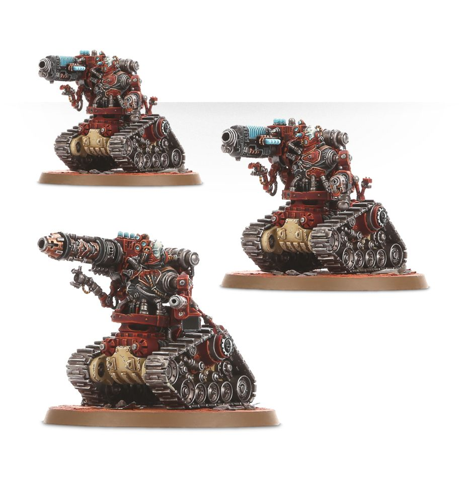

# 武裝奴工毀滅者（Kataphron Destroyers）
## 官方產品圖片

> **圖片來源：** [Games Workshop 官方商店](https://www.warhammer.com/en-WW/shop/Kataphron-Battle-Servitors-Destroyers-2017)。官方商品主圖。
> **圖片擷取日期：** 2026-08-22。

本頁依使用者提供的《機械修會11版中文1.0.pdf》建立，並以官方 Munitorum Field Manual v1.2 的現行點數為準。規則關鍵字採繁體中文；英文名稱僅保留作為原文索引。

## 單位數據

| M | T | SV | W | LD | OC | 特殊保護 |
|---:|---:|---:|---:|---:|---:|---:|
| 5 | 6 | 3+ | 3 | 7+ | 1 | 6+ |

## 能力

**陣營：機神律令。** 本單位可受機神律令影響。

**哨戒指令。** 當你對本單位使用堅守射擊策略時，未修正命中結果 5+ 即可造成堅守射擊命中。

## 武器

| 武器 | 射程 | A | BS／WS | S | AP | D | 能力 |
|---|---:|---:|---:|---:|---:|---:|---|
| 智能噴火器 | 12 | D6 | — | 4 | 0 | 1 | 忽視掩體、噴射 |
| 重型重力炮 | 30 | 4 | 4+ | 6 | -1 | 2 | 反載具 2+ |
| 磷火槍 | 24 | 1 | 4+ | 5 | 0 | 1 | 忽視掩體、速射 1 |
| 等離子長管炮：標準 | 36 | 4 | 4+ | 7 | -2 | 1 | 無 |
| 等離子長管炮：過載 | 36 | 4 | 4+ | 8 | -3 | 2 | 危險 |
| 格鬥武器 | 近戰 | 2 | 4+ | 5 | 0 | 1 | 無 |

## 編制、點數與裝備

| 項目 | 內容 |
|---|---|
| 編制 | 3 個武裝奴工毀滅者；可增加 3 個相同模型。 |
| 點數 | 100／200 分 |
| 裝備 | 重型重力炮、磷火槍、格鬥武器。 |
| 升級選項 | 任意模型可將重型重力炮換為等離子長管炮；任意模型可將磷火槍換為智能噴火器。 |
| 版本註記 | MFM v1.2：3／6 模型為 100／200 分；點數依官方 Munitorum Field Manual v1.2。 |

## 關鍵字

**關鍵字：** 步兵、帝國、機械教、武裝奴工、毀滅者。

**陣營關鍵字：** 機械修會。

## 資料來源

本頁規則資料依使用者提供的《機械修會11版中文1.0.pdf》整理，並套用官方 Faction Pack 1.1 更新；點數依官方 Munitorum Field Manual v1.2。

## References

[1]: https://mfm.warhammer-community.com/en/adeptus-mechanicus "Munitorum Field Manual｜Adeptus Mechanicus v1.2"
[2]: https://assets.warhammer-community.com/eng_22-07_warhammer_40,000_faction_pack_adeptus_mechanicus-d1ubc1apog-mpt3r8xzy4.pdf "Faction Pack: Adeptus Mechanicus Version 1.1"
