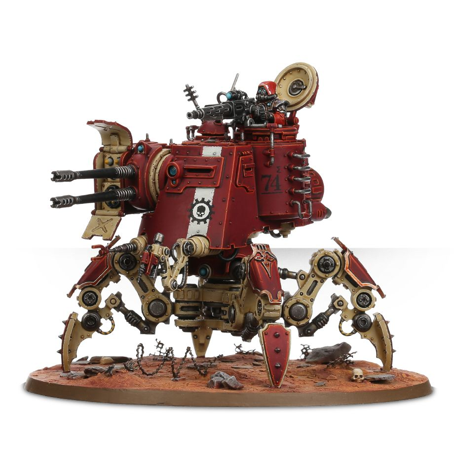

# 沙丘爬行者機甲（Onager Dunecrawler）
## 官方產品圖片

> **圖片來源：** [Games Workshop 官方商店](https://www.warhammer.com/en-WW/shop/Onager-Dunecrawler)。官方商品主圖。
> **圖片擷取日期：** 2026-08-22。

本頁依使用者提供的《機械修會11版中文1.0.pdf》建立，並以官方 Munitorum Field Manual v1.2 的現行點數為準。規則關鍵字採繁體中文；英文名稱僅保留作為原文索引。

## 單位數據

| M | T | SV | W | LD | OC | 特殊保護 |
|---:|---:|---:|---:|---:|---:|---:|
| 8 | 10 | 2+ | 11 | 7+ | 3 | 4+ |

## 能力

**陣營：機神律令。** 本模型可受機神律令影響。

**核心：致命破滅 D3。** 本模型擁有致命破滅 D3。

**疾行機甲（Swift Walker）。** 每當本模型進行標準、加速或撤退移動時，可以穿過友軍巨獸與載具模型，以及高度不超過 4 吋的地形。

**力場投射。** 完全位於本模型 6 吋內的機械修會戰線模型對抗射擊攻擊時擁有特殊保護 4+。

**四足爬行。** 進行標準、加速或撤退移動時，可以穿越友軍巨獸或載具模型，以及高度不超過 4 吋的地形。

**嚴重損傷。** 本模型傷口為 1–4 時，攻擊命中結果減 1。

## 武器

| 武器 | 射程 | A | BS／WS | S | AP | D | 能力 |
|---|---:|---:|---:|---:|---:|---:|---|
| 智能重機槍 | 36 | 3 | 4+ | 4 | 0 | 1 | 速射 3、連擊 1 |
| 代達羅斯導彈 | 48 | 2 | 4+ | 10 | -2 | D6+1 | 反飛行 2+ |
| 中子雷射 | 48 | 3 | 4+ | 16 | -4 | D6+2 | 重型 |
| 伊卡洛斯陣列 | 48 | 6 | 4+ | 8 | -1 | 2 | 反飛行 4+、雙聯 |
| 雙聯重型磷火炮 | 36 | 12 | 4+ | 6 | -1 | 2 | 忽視掩體、雙聯 |
| 滅絕射線：散射 | 36 | 3D3 | 4+ | 9 | -2 | 2 | 爆炸、連擊 1 |
| 滅絕射線：聚焦 | 18 | 3D3 | 4+ | 10 | -3 | 3 | 爆炸、連擊 1 |
| 爬行鐵爪 | 近戰 | 3 | 4+ | 6 | 0 | 1 | 無 |

## 編制、點數與裝備

| 項目 | 內容 |
|---|---|
| 編制 | 1 臺沙丘爬行者機甲。 |
| 點數 | 155 分 |
| 裝備 | 滅絕射線、爬行鐵爪。 |
| 升級選項 | 滅絕射線可換為代達羅斯導彈與伊卡洛斯陣列、中子雷射與智能重機槍，或雙聯重型磷火炮；可額外裝備一挺智能重機槍與廣域數據鏈。 |
| 版本註記 | Faction Pack 1.1 新增機動關鍵字與疾行機甲；點數依 MFM v1.2：155 分 |

## 關鍵字

**關鍵字：** 載具、機甲、帝國、護教軍、煙霧彈、機動、沙丘爬行者。

**陣營關鍵字：** 機械修會。

## 資料來源

本頁規則資料依使用者提供的《機械修會11版中文1.0.pdf》整理，並套用官方 Faction Pack 1.1 更新；點數依官方 Munitorum Field Manual v1.2。

## References

[1]: https://mfm.warhammer-community.com/en/adeptus-mechanicus "Munitorum Field Manual｜Adeptus Mechanicus v1.2"
[2]: https://assets.warhammer-community.com/eng_22-07_warhammer_40,000_faction_pack_adeptus_mechanicus-d1ubc1apog-mpt3r8xzy4.pdf "Faction Pack: Adeptus Mechanicus Version 1.1"
