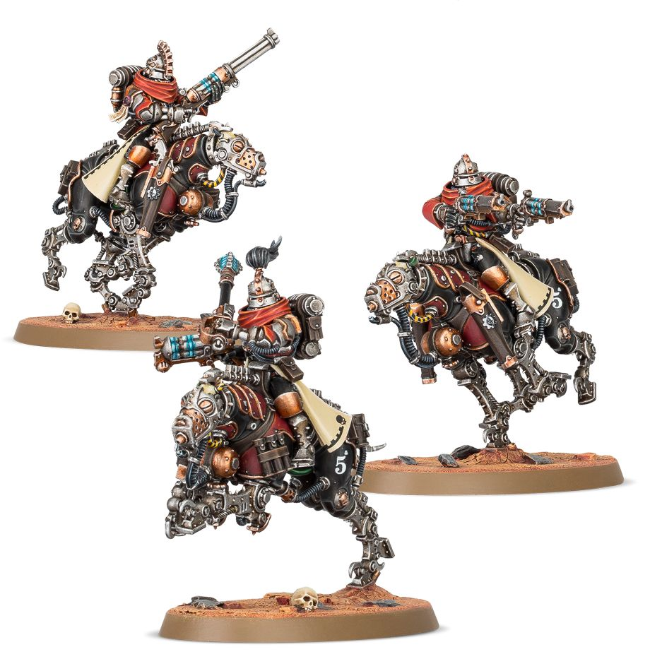

# 瑟貝利硫磺獵犬（Serberys Sulphurhounds）
## 官方產品圖片

> **圖片來源：** [Games Workshop 官方商店](https://www.warhammer.com/en-WW/shop/Adeptus-Mechanicus-Serberys-Sulphurhounds--2020)。官方商品主圖。
> **圖片擷取日期：** 2026-08-22。

本頁依使用者提供的《機械修會11版中文1.0.pdf》建立，並以官方 Munitorum Field Manual v1.2 的現行點數為準。規則關鍵字採繁體中文；英文名稱僅保留作為原文索引。

## 單位數據

| M | T | SV | W | LD | OC | 特殊保護 |
|---:|---:|---:|---:|---:|---:|---:|
| 12 | 4 | 4+ | 2 | 7+ | 2 | 5+ |

## 能力

**陣營：機神律令。** 本單位可受機神律令影響。

**衝鋒陷陣。** 完成衝鋒移動時，對接戰範圍內一個敵方單位按本單位接戰模型數擲 D6；若衝鋒開始時本單位 6 吋內有機械修會戰線友軍，擲骰結果加 2；每個 4+ 造成 1 點致命傷害。

## 武器

| 武器 | 射程 | A | BS／WS | S | AP | D | 能力 |
|---|---:|---:|---:|---:|---:|---:|---|
| 機械教手槍 | 12 | 1 | 4+ | 6 | -1 | 1 | 毀滅傷害、手槍 |
| 磷火爆裂槍 | 18 | D6 | 4+ | 6 | 0 | 1 | 忽視掩體、爆炸 |
| 磷火手槍 | 12 | 1 | 4+ | 4 | 0 | 1 | 忽視掩體、手槍 |
| 硫磺吐息 | 9 | D6 | — | 3 | -1 | 1 | 忽視掩體、噴射、手槍 |
| 電弧錘 | 近戰 | 4 | 4+ | 5 | -1 | 1 | 反載具 4+、毀滅傷害、額外攻擊 |
| 利爪 | 近戰 | 4 | 4+ | 4 | 0 | 1 | 無 |

## 編制、點數與裝備

| 項目 | 內容 |
|---|---|
| 編制 | 1 個硫磺獵犬隊長與 2 個硫磺獵犬；可增加 3 個硫磺獵犬。 |
| 點數 | 55／100 分 |
| 裝備 | 隊長：機械教手槍、硫磺吐息、電弧錘、利爪；硫磺獵犬：兩把磷火手槍、硫磺吐息、利爪。 |
| 升級選項 | 每 3 個模型中，一個硫磺獵犬可將一把磷火手槍換為磷火爆裂槍。 |
| 版本註記 | MFM v1.2：前兩個單位 3／6 模型為 55／100 分；第三個以上為 65／110 分；點數依官方 Munitorum Field Manual v1.2。 |

## 關鍵字

**關鍵字：** 騎乘、帝國、護教軍、瑟貝利硫磺獵犬。

**陣營關鍵字：** 機械修會。

## 資料來源

本頁規則資料依使用者提供的《機械修會11版中文1.0.pdf》整理，並套用官方 Faction Pack 1.1 更新；點數依官方 Munitorum Field Manual v1.2。

## References

[1]: https://mfm.warhammer-community.com/en/adeptus-mechanicus "Munitorum Field Manual｜Adeptus Mechanicus v1.2"
[2]: https://assets.warhammer-community.com/eng_22-07_warhammer_40,000_faction_pack_adeptus_mechanicus-d1ubc1apog-mpt3r8xzy4.pdf "Faction Pack: Adeptus Mechanicus Version 1.1"
