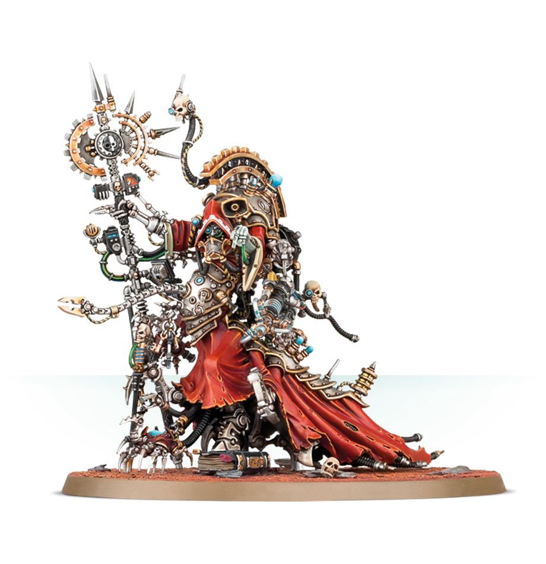

# 貝利撒留・考爾（Belisarius Cawl）
## 官方產品圖片

> **圖片來源：** [Games Workshop 官方商店](https://www.warhammer.com/en-WW/shop/Adeptus-Mechanicus-Belisarius-Cawl-2017)。官方商品主圖。
> **圖片擷取日期：** 2026-08-22。

本頁依使用者提供的《機械修會11版中文1.0.pdf》建立，並以官方 Munitorum Field Manual v1.2 的現行點數為準。規則關鍵字採繁體中文；英文名稱僅保留作為原文索引。

## 單位數據

| M | T | SV | W | LD | OC | 特殊保護 |
|---:|---:|---:|---:|---:|---:|---:|
| 8 | 8 | 2+ | 10 | 6+ | 3 | 4+ |

## 能力

**陣營：機神律令。** 本模型可受機神律令影響。

**機械頌歌。** 在你的指揮階段開始時，選擇一項能力，持續至你的下一個指揮階段開始：機魂復仇禱告使友軍機械修會單位攻擊指定敵方目標時可重擲命中；紀律真言光環使本模型獲得戰線，並使 6 吋內友軍機械修會單位的領導力測試結果與目標控制各加 1；迷霧詩篇光環使 6 吋內友軍機械修會單位獲得隱蔽。

**機械保鏢。** 當本模型位於其他友軍機械修會單位 3 吋內時，本模型獲得獨行特工。

**自我修復。** 你的指揮階段開始時，本模型恢復 D3 點失去的傷口。

**至高指揮官。** 本模型必須成為你的軍隊主將。

**體形適中。** 本模型可以如同步兵模型一樣正常穿過地形並登上更高樓層。

## 武器

| 武器 | 射程 | A | BS／WS | S | AP | D | 能力 |
|---|---:|---:|---:|---:|---:|---:|---|
| 太陽射線 | 18 | 3 | 2+ | 14 | -4 | D6 | 爆炸、熱熔 3 |
| 電弧長鞭 | 近戰 | 4 | 2+ | 5 | -1 | 1 | 反載具 4+、毀滅傷害、額外攻擊 |
| 機神戰斧 | 近戰 | 4 | 2+ | 8 | -2 | 2 | 無 |
| 機械蜂巢 | 近戰 | 2D6 | 3+ | 4 | 0 | 1 | 額外攻擊 |

## 編制、點數與裝備

| 項目 | 內容 |
|---|---|
| 編制 | 貝利撒留・考爾是全軍唯一的獨特模型。 |
| 點數 | 220 分 |
| 裝備 | 太陽射線、電弧長鞭、機神戰斧、機械蜂巢。 |
| 升級選項 | 無。 |
| 版本註記 | Faction Pack 1.1 將其移動改為 8，並加入機動關鍵字；本頁採用更新後版本；點數依官方 Munitorum Field Manual v1.2。 |

## 關鍵字

**關鍵字：** 巨獸、人物、機動、史詩英雄、帝國、技術牧師、機械教、貝利撒留・考爾。

**陣營關鍵字：** 機械修會。

## 資料來源

本頁規則資料依使用者提供的《機械修會11版中文1.0.pdf》整理，並套用官方 Faction Pack 1.1 更新；點數依官方 Munitorum Field Manual v1.2。

## References

[1]: https://mfm.warhammer-community.com/en/adeptus-mechanicus "Munitorum Field Manual｜Adeptus Mechanicus v1.2"
[2]: https://assets.warhammer-community.com/eng_22-07_warhammer_40,000_faction_pack_adeptus_mechanicus-d1ubc1apog-mpt3r8xzy4.pdf "Faction Pack: Adeptus Mechanicus Version 1.1"
